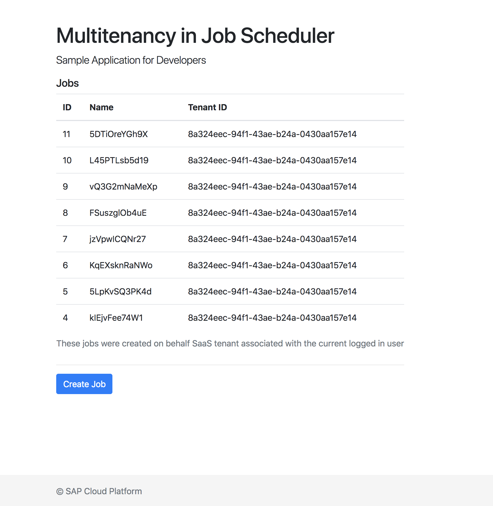

# multitenancy-demo
A sample application that can be used for jobscheduler multitenancy development/demo



## Installation

**Prepare Files**

- Open `manifest.yml` file using editor
- Replace `[CF_APPS_DOMAIN]` with the application domain of your cloud foundry landscape. For CF Canary, it will be `cfapps.sap.hana.ondemand.com`.
- Open `core/routes/SaaSRegistryCallbacks.js` and replace `[i-number]` in line 25 with your SAP I-Number

**Prepare xs-security.json**

- Open `resources/xs-security.json` file using editor
- Replace `[i-number]` with your SAP I-Number

**Create service instances**

Create Job Scheduler service instance - 

    cf create-service jobscheduler standard jsmt-sample-jobscheduler

Create XSUAA service instance - 

    cf create-service xsuaa application jsmt-sample-uaa -c resources/xs-security.json


**Install Dependencies**

```sh
pushd core
npm install
popd
pushd web
npm install
popd
```

**Deploy Application**

Using `manifest.yml`, push the application

    cf push -f manifest.yml

This step will deploy 2 applications - `jsmt-sample-web` and `jsmt-sample-core`

**Configure XSUAA Service**

**Configure SaaS Registry Service**

## Subscriptions

* Launch SAP Cloud Platform Cockpit and navigate to the Global Account and Sub Account where 